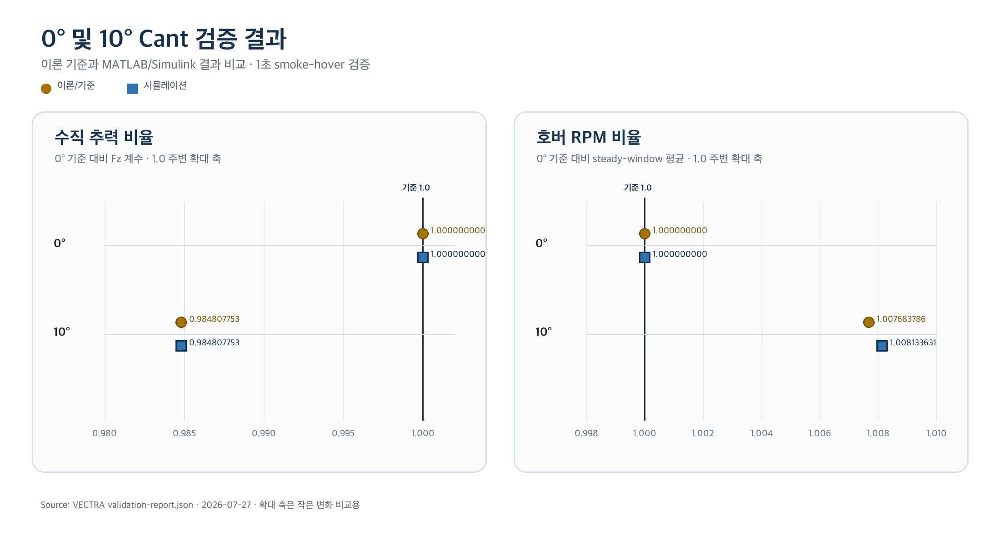

# VECTRA Cant-Angle 모델 구현 및 검증 보고서

**부제:** QuadSim 기반 3차원 로터 추력축, 동역학 및 제어 할당 구현<br>
**문서 버전:** 1.0<br>
**검증 환경:** MATLAB/Simulink R2026a<br>
**검증 완료:** 2026-07-27 13:00:43 (Asia/Seoul)<br>
**작성:** VECTRA 연구팀 - 프로그래밍 및 시뮬레이션 파트

<!-- body -->

## 기술 요약

VECTRA의 Cant-Angle MVP 구현은 승인된 최소 검증 범위를 모두 통과했다. 고정된
upstream QuadSim 모델은 수정하지 않았으며, VECTRA 소유의 Simulink 복사본에
모터별 3차원 추력축, 암 모멘트, 반작용 토크, 일반화된 자이로스코픽 모멘트와
cant-aware 제어 할당을 추가했다.

0도 모델은 upstream 기준 모델과 사실상 동일하게 동작했다. 1초 회귀 실행에서
최대 상태 오차는 `6.46e-13`, 최대 모터 RPM 오차는 `2.18e-9 rpm`이었다.
10도 대칭 radial-outward cant에서는 수직 추력 비율이 이론값
`cos(10 deg) = 0.9848077530`과 일치했고, 호버 RPM 비율은 이론값
`1/sqrt(cos(10 deg)) = 1.0076838`에 대해 `1.0081336`으로 증가했다. 모든
상태는 유한했고 모터 한계 초과는 없었다.

따라서 이번 검증은 “Cant 구현이 의도한 물리 방향과 0도 회귀 조건을
만족한다”는 구현 가설을 지지한다. 다만 1초짜리 0도/10도 비교만으로 실제
기체의 효율, 안정성 또는 최적 cant angle을 입증한 것은 아니다. 그 결론은
기체 구성, 프로펠러 구성, 질량과 무게중심을 고정하고 cant angle만 변화시키는
후속 실험에서 다뤄야 한다.

> **최종 판정:** 단위 테스트 9개 통과, 0도 회귀 통과, 10도 물리 방향성 검증
> 통과, 전체 `passed = true`.

<!-- pagebreak -->

## 1. 연구 목적과 검증 질문

### 1.1 목적

본 단계의 목적은 QuadSim을 실제 연구용 cant-angle 비교 실험에 사용하기
전에, 각 로터의 추력축을 기체 수직축에서 기울일 수 있도록 동역학과 제어
할당을 확장하고 그 구현 방향이 옳은지 최소한으로 검증하는 것이다.

검증 대상은 다음 세 가지다.

1. cant angle이 0도일 때 VECTRA 모델이 고정된 upstream QuadSim 기준과
   수치적으로 동일한가?
2. 대칭 radial-outward cant를 적용하면 이론대로 수직 추력 성분이 감소하고
   동일 호버 조건의 요구 RPM이 증가하는가?
3. 대칭 배치에서 동일 RPM의 수평 추력 성분이 상쇄되고, 실행 결과가 유한하며
   모터 한계를 넘지 않는가?

### 1.2 구현 가설

- **H0 - 0도 회귀 가설:** cant angle이 0도이면 새로운 wrench matrix와
  allocator는 upstream 모델의 힘, 모멘트, 상태 및 모터 응답을 허용 오차
  내에서 재현한다.
- **H1 - 방향성 가설:** 모든 모터를 동일한 각도 `theta`로 radial-outward
  cant하면 수직 추력 비율은 `cos(theta)`가 되고, 단순 호버에서 요구 RPM
  비율은 `1/sqrt(cos(theta))` 방향으로 증가한다.
- **H2 - 대칭성 가설:** 대칭 `+` 배치에서 네 모터가 동일 RPM으로 회전하면
  수평 추력 계수의 합은 0에 수렴한다.

이 가설들은 구현 검증 가설이다. “cant가 실제 비행 성능을 향상시킨다”는
연구 가설과는 구분한다.

## 2. 이론적 모델

### 2.1 좌표계와 로터 축

기체 좌표계는 upstream QuadSim의 `QUADSIM_BODY_XY_ZUP`을 따른다. 모터
`i`의 위치 벡터를 `r_i`, 기체에 작용하는 단위 추력축을 `u_i`, 회전수를
`n_i`(rpm)로 둔다. 양의 radial-outward cant는 `u_i`를 기체 `+z` 방향에서
각 모터의 수평 방사 방향으로 기울인다.

10도 구성은 모터 순서를 `+X`, `+Y`, `-X`, `-Y`로 고정하고 모든 모터에
10도를 적용한다. 회전 방향은 `CCW, CW, CCW, CW`이며, 반작용 토크 부호는
로터 회전 부호의 반대다.

### 2.2 모터별 힘과 모멘트

```text
T_i = C_T,i * n_i^2
F_i = T_i * u_i
M_arm,i = r_i x F_i
M_reaction,i = s_reaction,i * C_Q,i * n_i^2 * u_i
```

전체 추진 힘과 모멘트는 다음과 같다.

```text
F_body = sum(F_i)
M_prop = sum(M_arm,i + M_reaction,i)
```

각 모터가 만드는 6축 wrench를 열벡터로 모으면 다음 행렬을 얻는다.

```text
B = [Fx; Fy; Fz; Mx; My; Mz] per rpm^2
w = B * [n_1^2; n_2^2; n_3^2; n_4^2]
```

제어 할당에는 `Fz, Mx, My, Mz` 네 행으로 구성한 `B4`를 사용하며,
`rank(B4) = 4`인 구성만 허용한다.

### 2.3 일반화된 로터 자이로스코픽 모멘트

기존 QuadSim은 모든 로터 축이 기체 `z`축과 일치한다고 가정한다. VECTRA는
모터별 실제 추력축을 사용해 로터 각운동량을 계산한다.

```text
H_rotor = sum(s_spin,i * J_m,i * n_i * 2*pi/60 * u_i)
M_gyro = -omega_body x H_rotor
```

0도에서는 이 식이 기존 QuadSim의 자이로스코픽 항과 일치해야 한다.

### 2.4 수직 추력과 호버 RPM 예측

대칭 cant에서 각 로터의 수직 성분은 `T_i*cos(theta)`다. 질량과 추력
계수가 동일하고 네 모터 RPM이 같다고 가정하면 다음 관계를 얻는다.

```text
vertical force scale = cos(theta)
n_hover,cant / n_hover,0 = 1 / sqrt(cos(theta))
```

10도에서 이론적 수직 추력 손실은 약 `1.5192%`, 호버 RPM 증가는 약
`0.7684%`다.

## 3. 구현 구조

### 3.1 upstream 보존 원칙

외부 의존성 `vendor/QuadSim`은 commit
`961bc69d4939c8d0661eeb9820de668994262f65`에 고정했고 수정하지 않았다.
Cant 구현은 `models/quadsim/VECTRA_Cant_Quadcopter_Simulation.slx`와
VECTRA MATLAB package 내부에만 존재한다. 따라서 upstream 기준을
회귀 기준으로 계속 사용할 수 있다.

### 3.2 실행 파이프라인

```text
geometry JSON
    -> buildRotorGeometry
    -> extendQuadModel / buildWrenchMatrix
    -> upstream PID + mixer reference
    -> cant-aware control allocation
    -> original motor saturation and dynamics
    -> cant-aware rigid-body dynamics
    -> normalized 24-column output + diagnostics
```

기존 PID와 mixer는 목표 wrench를 만드는 기준으로 유지했다. allocator는
기준 모터 RPM에서 `Fz, Mx, My, Mz` 목표값을 계산하고, canted `B4`를
풀어 새 모터 명령을 만든다. 음수 squared-RPM 요구, RPM 상한, allocation
residual과 달성 wrench를 진단값으로 남긴다.

### 3.3 주요 구현 파일

| 역할 | 구현 파일 |
|---|---|
| 형상 및 로터 축 | `buildRotorGeometry.m`, `validateCantConfiguration.m` |
| 6축 힘/모멘트 | `buildWrenchMatrix.m`, `extendQuadModel.m` |
| 제어 할당 | `buildControlAllocation.m`, `allocateMotorCommands.m` |
| 명령 변환 | `throttleToTargetRpm.m`, `targetRpmToThrottle.m` |
| 자이로스코픽 항 | `calculateGyroscopicMoment.m` |
| Simulink 동역학 | `vectraCantDynamicsSFunction.m` |
| Simulink allocator | `vectraCantAllocatorSFunction.m` |
| 실행 및 기록 | `runCant.m`, `runCantValidationLogged.m` |
| 자동 검증 | `validateCantImplementation.m`, `TestQuadSimMath.m` |

## 4. 검증 설계

### 4.1 비교 조건

| 구분 | 모델 | Cant angle | 목적 |
|---|---|---:|---|
| 기준 | upstream `AC_Quadcopter_Simulation` | 0도 | 변경 전 기준 |
| 회귀 | VECTRA Cant model | 0도 | 구현이 기준을 보존하는지 확인 |
| 방향성 | VECTRA Cant model | 10도 | 이론적 추력/RPM 방향 확인 |

세 실행은 동일한 upstream `quadModel_+`, 초기조건과 `smoke_hover`
설정을 사용했고 검증 구간은 1초다.

### 4.2 판정 기준

- 시간 격자 차이: `1e-9 s` 이하
- 0도 최대 상태 오차: `1e-8` 이하
- 0도 최대 RPM 오차: `1e-6 rpm` 이하
- 0도 throttle 오차: 마지막 불연속 샘플을 제외하고 `1e-6%` 이하
- 10도 수직 추력 비율: `cos(10 deg)`와 `1e-12` 이내
- 대칭 수평 계수 합의 norm: `1e-15` 이하
- 호버 RPM 비율: 1보다 크고 이론값과 `0.02` 이내
- 모든 상태 유한, 모터 최대 RPM 미초과

1초 끝점은 legacy 명령 불연속과 정확히 겹친다. 추가된 direct-feedthrough
allocator 때문에 그 시점의 algebraic throttle 출력 순서가 달라질 수 있어
마지막 throttle 샘플 하나만 회귀 비교에서 제외했다. 연속 상태와 RPM은 전체
샘플을 비교했다.

## 5. 검증 결과

### 5.1 전체 판정

MATLAB R2026a에서 단위 테스트 9개가 모두 통과했고, 0도 및 10도 통합
시뮬레이션이 정상 종료했다.

```text
UNIT_PASSED=9 UNIT_FAILED=0
CANT_VALIDATION_PASSED=1
VECTRA_CANT_VALIDATION_COMPLETE=27-Jul-2026 13:00:43
```



**그림 1.** 0도 기준과 10도 대칭 radial-outward cant의 이론값/시뮬레이션
비교. 두 패널 모두 1.0 주변의 작은 변화를 보기 위한 확대 축이며 정확한
수치는 점 옆에 표시했다.

### 5.2 0도 회귀 결과

| 지표 | 결과 | 허용 기준 | 판정 |
|---|---:|---:|---|
| 동일 시간 격자 | true | true | 통과 |
| 최대 상태 오차 | `6.4559e-13` | `<= 1e-8` | 통과 |
| 최대 RPM 오차 | `2.1810e-9 rpm` | `<= 1e-6 rpm` | 통과 |
| 최대 throttle 오차 | `1.7337e-12%` | `<= 1e-6%` | 통과 |

모든 오차가 허용 기준보다 충분히 작다. 따라서 VECTRA의 0도 wrench,
allocator와 동역학은 승인된 검증 구간에서 upstream 기준을 보존했다.

### 5.3 10도 방향성 결과

| 지표 | 이론/기준 | 시뮬레이션 | 판정 |
|---|---:|---:|---|
| 수직 추력 비율 | `0.9848077530122080` | `0.9848077530122081` | 통과 |
| 호버 RPM 비율 | `1.0076837856618241` | `1.0081336305103508` | 통과 |
| 수평 계수 합 `Fx` | 0 | `1.5806e-24` | 통과 |
| 수평 계수 합 `Fy` | 0 | `3.3087e-24` | 통과 |
| 유한 상태 | true | true | 통과 |
| 모터 한계 초과 | false | false | 통과 |

시뮬레이션의 호버 RPM 증가는 약 `0.8134%`로, 이론적 증가
`0.7684%`와 같은 방향이며 차이는 약 `0.0450 percentage point`다. 이 작은
차이는 닫힌루프 제어기, 과도응답 구간과 steady-window 평균의 영향을 포함한다.
이 결과는 `1/sqrt(cos(theta))`가 정적 단순 모델의 기준선이며 완전한
폐루프 시계열 예측식은 아니라는 점과 일치한다.

## 6. 해석

첫째, 0도 회귀가 매우 작은 오차로 통과했기 때문에 Cant 기능을 넣으면서
기존 QuadSim의 좌표계, 모터 순서 또는 yaw 반작용 토크 부호를 잘못 바꿨을
가능성은 낮다. 특히 로터 회전 부호와 기체에 작용하는 반작용 토크 부호를
서로 반대로 정의한 것이 upstream yaw moment row를 재현하는 데 중요했다.

둘째, 10도에서 수직 추력 비율이 `cos(10 deg)`와 일치하고 수평 성분이
수치적으로 상쇄됐다. 이는 motor-specific rotor axis와 wrench matrix가
대칭 radial-outward 형상을 의도대로 나타낸다는 직접 증거다.

셋째, 호버 RPM이 증가했고 actuator limit에는 도달하지 않았다. 따라서
현재 10도 설정은 최소 smoke-hover 조건에서 제어 할당이 가능한 사례다.
그러나 RPM 증가만으로 전력 소비나 효율 저하량을 확정할 수는 없다. 배터리,
모터 효율, 프로펠러 공력과 wake 상호작용이 현재 모델에 없기 때문이다.

## 7. 한계와 불확실성

- 검증 시간은 1초이며 0도와 대표 10도 한 점만 비교했다.
- vehicle profile은 실제 연구 기체의 질량, 관성 및 추진계 측정값으로 완전
  보정되지 않았다.
- `C_T`와 `C_Q`는 RPM 및 유동 상태에 따라 변하지 않는 계수로 취급한다.
- blade flapping, rotor-to-rotor wake, 지면 효과, 프레임 항력, 배터리 전압
  강하와 모터 효율을 모델링하지 않았다.
- allocator는 full-rank 선형 해를 사용한다. actuator bound에서 최적화하는
  constrained allocator는 후속 과제다.
- 마지막 throttle 샘플 하나는 legacy 불연속 때문에 0도 회귀에서 제외했다.
  상태와 RPM 샘플은 제외하지 않았다.
- upstream 모델의 Model History deprecation warning은 MATLAB R2026a
  호환성 경고다. 이번 실행을 중단하거나 결과 판정을 바꾸지는 않았다.
- 이 결과는 실제 Pixhawk/PX4 비행 제어기 검증이나 비행 안전 승인을
  의미하지 않는다.

## 8. 후속 연구 실험 설계

다음 단계에서는 cant angle만의 구현 검증을 넘어 실제 연구 질문을 다룬다.
독립변수는 **cant angle** 하나로 제한하며, 0도를 기준으로 승인된 각도 수준을
대칭 적용한다. 기체 구성, 프로펠러 구성, 질량과 무게중심은 모든 실행에서
동일하게 유지하고 resolved configuration snapshot에 기록한다.

각 cant angle 조건에서는 호버 RPM, 자세 오차, settling time, 제어 allocation residual,
motor saturation, 추정 추진 여유와 비행 기록에서 비교 가능한 센서 지표를
수집한다. 시뮬레이션에서 유망하거나 한계가 명확한 조합을 선별한 뒤,
Pixhawk/PX4 비행 로그와 동일한 데이터 사전으로 정렬해 비교한다.

현재 결과는 후속 실험의 baseline qualification으로 사용하되, 10도 한 점을
최적값으로 취급하지 않는다.

## 9. 재현 방법

VECTRA root에서 MATLAB을 열고 다음을 실행한다.

```matlab
run("startup.m")
runCantValidationLogged()
```

콘솔 전체 기록과 기계 판독 가능한 결과는 다음 위치에 생성된다.

```text
results/reports/cant-validation/console.log
results/reports/cant-validation/validation-report.json
```

성공 실행에서는 다음 표식이 모두 나타나야 한다.

```text
UNIT_FAILED=0
CANT_VALIDATION_PASSED=1
VECTRA_CANT_VALIDATION_COMPLETE=<timestamp>
```

<!-- pdf-pagebreak -->

## 10. 결론

VECTRA는 upstream QuadSim을 보존하면서 모터별 3차원 cant geometry를
Simulink 동역학과 제어 할당에 통합했다. 0도 회귀는 수치 허용 오차보다
충분히 작은 차이로 통과했고, 10도 대칭 cant는 예측된 수직 추력 감소,
호버 RPM 증가와 수평 힘 상쇄를 보였다. 실행은 유한했고 모터 한계를 넘지
않았다.

따라서 Cant-Angle MVP는 다음 제어 실험을 시작할 수 있는 baseline-qualified
상태다. 이후 연구에서는 실제 기체 파라미터를 보정하고 기체 구성, 프로펠러
구성, 질량과 무게중심을 고정한 상태에서 cant angle만 체계적으로 변화시켜
성능과 한계를 정량화해야 한다.

## 참고 자료

1. dch33, **Quad-Sim**, GitHub repository, pinned commit
   `961bc69d4939c8d0661eeb9820de668994262f65`,
   <https://github.com/dch33/Quad-Sim>.
2. VECTRA, `docs/plans/cant-implementation-plan.md`, Cant-Angle 구현 계획 및
   완료 기록, 2026-07-27.
3. VECTRA, `results/reports/cant-validation/validation-report.json`, 최종
   MATLAB R2026a 검증 결과, 2026-07-27.
4. VECTRA, `models/quadsim/functions/vectraCantDynamicsSFunction.m` 및
   `vectraCantAllocatorSFunction.m`, Cant 동역학 및 제어 할당 구현.
