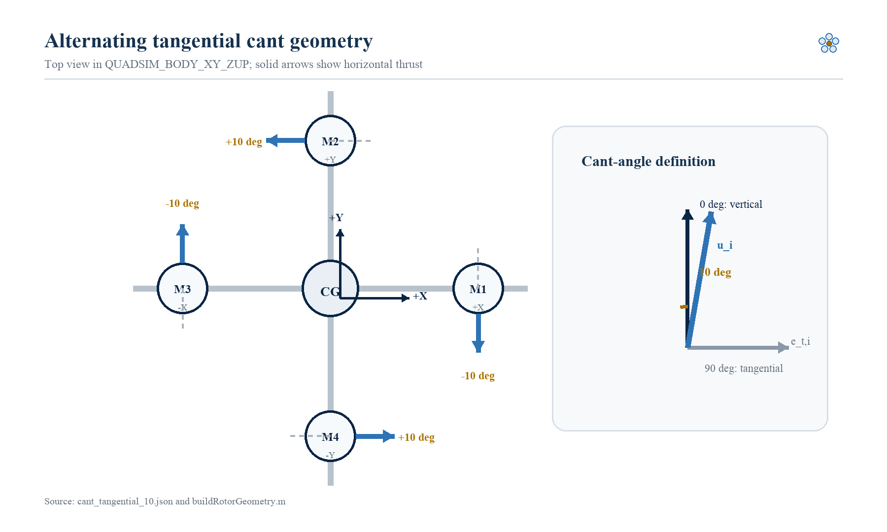
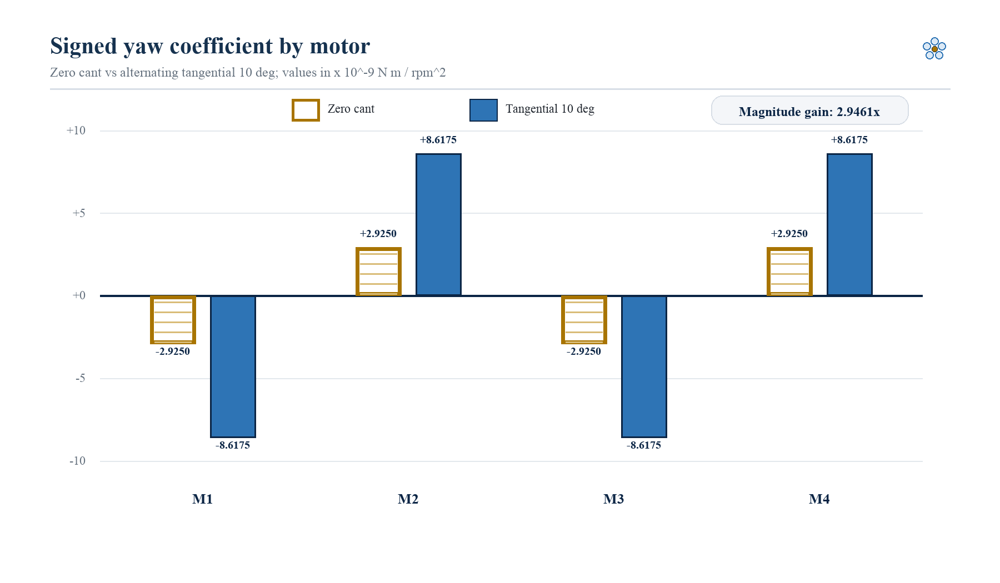
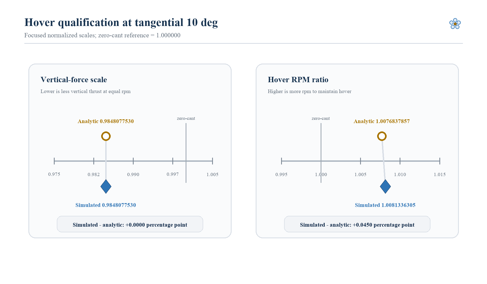

# VECTRA 교대 접선방향 Cant 모델 및 Yaw 권한 검증 보고서

**부제:** QuadSim 기반 교대 `[-10°, +10°, -10°, +10°]` 로터축, Yaw 모멘트 및 제어 할당 검증<br>
**문서 버전:** 1.0<br>
**검증 환경:** MATLAB/Simulink R2026a<br>
**검증 완료:** 2026-07-28 09:28:33 (Asia/Seoul)<br>
**작성:** VECTRA 연구팀 - 프로그래밍 및 시뮬레이션 파트<br>
**현재 형상:** `alternating-tangential-cant-10`

<!-- body -->

## 기술 요약

VECTRA의 cant angle을 **기체 수직축에서 각 모터 위치의 접선방향으로 기울어진
각도**로 새로 정의하고, 네 모터에 `[-10°, +10°, -10°, +10°]`를 교대로
적용했다. 이 정의에서 `0°`는 모터 추력축이 기체 `+Z` 방향과 일치하는
상태이고, `90°`는 추력축이 수평 접선방향을 향하는 상태다. 부호는 각
모터의 양의 접선 단위벡터를 기준으로 한다.

새 형상의 모터별 yaw 계수 절댓값은 zero-cant 기준의
`2.9250 × 10^-9 N·m/rpm²`에서
`8.6175 × 10^-9 N·m/rpm²`로 증가했다. 따라서 현재 QuadSim 계수와 형상에서
모델링된 yaw 권한은 **`2.9461×`**다. 네 모터의 yaw 계수 부호는
`[-, +, -, +]`로 유지되어 기존 반작용 토크와 접선 추력의 암 모멘트가
각 모터에서 같은 yaw 방향으로 합쳐진다.

이 증가는 작은 호버 비용을 동반한다. 수직 추력 비율은
`cos(10°) = 0.9848078`로, 같은 RPM에서 수직 추력이 약 `1.5192%` 줄어든다.
단순 정적식의 호버 RPM 증가 예측은 `0.7684%`, 1초 smoke-hover
시뮬레이션 결과는 `0.8134%`였다. 제어 할당 행렬은 rank 4였고,
steady-hover 할당 residual norm은 `5.3560 × 10^-19`였다. 음수 squared-RPM
요구와 과속 요구는 없었고 시뮬레이션 상태는 유한했으며 모터 한계를 넘지
않았다.

2026-07-28의 fresh validation에서 자동 테스트 **19개가 모두 통과**했고,
zero-cant upstream 회귀와 tangential-cant 통합 검증도 통과했다. 따라서
현재 결과는 **교대 접선방향 cant의 물리 부호, 정적 yaw 계수, 호버 균형 및
제어 할당 구현이 의도대로 동작한다**는 결론을 지지한다.

> **검증 경계:** `2.9461×`는 현재 모델의 모터별 yaw effectiveness
> coefficient 증가율이다. 아직 yaw step의 rise time, settling time,
> overshoot, disturbance rejection 또는 실제 비행 yaw 성능이
> `2.9461×` 향상됐음을 뜻하지 않는다.

<!-- pagebreak -->

## 핵심 결과: 접선 추력이 Yaw 계수를 2.9461배로 높였다

### 형상 정의와 부호



**그림 1.** `QUADSIM_BODY_XY_ZUP`의 top view와 모터별 교대 접선방향 cant.
실선 접선 화살표는 각 모터의 실제 수평 추력 성분 방향을 나타내고, 점선은
반대 접선 기준을 나타낸다. 작은 측면 inset은 이 보고서의 각도 정의,
즉 `0° = vertical`, `90° = fully tangential`을 보여준다.

그림 1에서 모터 위치는 `+X`, `+Y`, `-X`, `-Y` 순서다. 각 위치에서 접선
단위벡터를 만들고 signed cant angle을 곱한다. M1과 M3은 `-10°`, M2와
M4는 `+10°`이므로 수평 추력 성분의 방향이 각 모터의 반작용 토크 yaw
부호와 정렬된다. 네 수평 힘의 벡터합은 0에 수렴하지만, 각 힘이 암 길이
`d`에서 만드는 yaw 모멘트는 상쇄되지 않고 원하는 교대 yaw 계수에 더해진다.

### 모터별 Yaw 계수



**그림 2.** Zero cant와 교대 접선방향 10도 cant의 모터별 signed yaw
coefficient. 단위는 `10^-9 N·m/rpm²`이며 zero line을 기준으로 M1/M3과
M2/M4의 부호를 직접 비교한다. 채움과 외곽선 패턴을 함께 사용해 색 없이도
두 형상을 구분할 수 있다.

모든 모터에서 계수 절댓값이 `2.9250`에서 `8.6175`로 증가했지만 부호 패턴은
`[-, +, -, +]`로 유지됐다. 즉 equal-command 상태에서는 총 yaw moment가
0이지만, allocator가 서로 반대 부호의 모터 쌍에 차등 명령을 주면 더 큰
yaw moment를 만들 수 있다. 여기서 `2.9461×`는 동적 응답 실험의 성능
배수가 아니라 allocation matrix의 yaw row에서 계산한 정적 권한 배수다.

### 호버 비용과 해석식 일치



**그림 3.** 10도 tangential cant의 수직 추력 scale과 hover RPM ratio.
수직 추력은 0도 기준에 대한 비율이며, RPM은 zero-cant smoke-hover
steady-window 평균에 대한 비율이다. analytic 값과 simulated 값을 서로
다른 marker로 표시했다.

수직 추력 scale은 analytic `0.9848077530122080`과 implemented
`0.9848077530122081`이 사실상 일치했다. Hover RPM ratio는 analytic
`1.0076838`과 simulated `1.0081336`으로 차이가 약
`0.0004498`, 즉 `0.0450 percentage point`였다. 이 차이는 정적
`1/sqrt(cos θ)` 기준식과 달리 smoke-hover 결과가 controller transient와
steady-window 평균을 포함하기 때문이다. 현재 모델에서는 약 1.52%의
수직 성분 손실로 약 2.95배의 yaw coefficient를 얻지만, 전력 또는 효율의
실제 변화는 모터/프로펠러/배터리 모델 없이 확정할 수 없다.

## 1. 범위와 Cant Angle 정의

### 1.1 연구 질문

이번 변경은 다음 질문에 답한다.

1. 접선방향 cant를 코드의 로터축과 wrench matrix에 일관되게 적용했는가?
2. 교대 signed angle이 네 모터의 yaw arm moment와 reaction torque를 같은
   부호로 정렬하는가?
3. Yaw coefficient 증가가 hover force balance, full-rank allocation,
   zero-cant regression 및 모터 한계 조건을 해치지 않는가?

이 질문들은 구현 및 모델 검증 질문이다. “실제 기체의 yaw 응답이
개선되는가?”와 “10도가 최적 각도인가?”는 후속 실험 질문이다.

### 1.2 새 정의

모터 `i`의 cant angle `θ_i`는 기체 `+Z` 축에서 모터 위치의 **양의 접선
단위벡터** `e_t,i` 방향으로 회전한 signed angle이다.

```text
0°   : u_i = +Z, motor thrust axis is vertical
90°  : u_i = +e_t,i, motor thrust axis is fully tangential
-θ_i : horizontal component points toward -e_t,i
```

사용자가 의도한 “motor up과 real up 사이 각도의 여각” 표현을 현재 정의에
맞추면, fully tangential 정도는 수직축과 로터축 사이의 직접 각도다.
따라서 이 보고서와 코드에서는 혼동을 피하기 위해 `θ_i = angle(+Z, u_i)`를
사용하며, `0°`를 수직, `90°`를 접선 수평으로 둔다.

### 1.3 좌표계와 모터 순서

| Motor | 위치/arm direction | Azimuth | Signed cant | 수평 추력 방향 | Reaction yaw sign |
|---|---:|---:|---:|---:|---:|
| M1 | `+X` | `0°` | `-10°` | `-Y` | `-` |
| M2 | `+Y` | `+90°` | `+10°` | `-X` | `+` |
| M3 | `-X` | `180°` | `-10°` | `+Y` | `-` |
| M4 | `-Y` | `-90°` | `+10°` | `+X` | `+` |

모터 순서와 spin direction은 각각
`[M1_POS_X, M2_POS_Y, M3_NEG_X, M4_NEG_Y]`,
`[CCW, CW, CCW, CW]`다. 기체에 작용하는 reaction torque sign은 rotor
spin sign의 반대인 `[-, +, -, +]`다.

## 2. 접선방향 로터축과 Yaw 모멘트 모델

### 2.1 단위벡터

모터 azimuth를 `φ_i`라 하면 radial 및 tangential unit vector는 다음과 같다.

```text
e_r,i = [ cos φ_i,  sin φ_i, 0 ]^T
e_t,i = [-sin φ_i,  cos φ_i, 0 ]^T
z_hat = [0, 0, 1]^T
```

Signed tangential cant `θ_i`를 적용한 추력축은 다음과 같다.

```text
u_i = sin(θ_i) e_t,i + cos(θ_i) z_hat
```

이 식은 `θ_i = 0°`에서 `u_i = z_hat`, `θ_i = 90°`에서
`u_i = e_t,i`를 만족한다. `sin(θ_i)`가 부호를 보존하므로 음의 cant는
반대 접선방향 수평 성분을 만든다.

### 2.2 모터별 힘과 전체 Wrench

모터 회전수 `n_i`의 단위는 rpm이며, 추력 및 반작용 토크 계수는 각각
`C_T,i`, `C_Q,i`다.

```text
T_i                  = C_T,i n_i^2
F_i                  = C_T,i n_i^2 u_i
M_arm,i              = r_i × F_i
M_reaction,i         = s_i C_Q,i n_i^2 u_i
M_prop               = Σ(M_arm,i + M_reaction,i)
F_body               = ΣF_i
```

여기서 `s_i`는 기체에 작용하는 reaction torque sign이다. 각 모터의
6-axis effectiveness를 열벡터로 모으면 다음 wrench matrix를 얻는다.

```text
B = [Fx; Fy; Fz; Mx; My; Mz] per rpm^2
w = B [n_1^2; n_2^2; n_3^2; n_4^2]
```

### 2.3 Yaw Effectiveness

모터가 중심에서 거리 `d`에 있고 추력 계수가 동일하다고 할 때 tangential
수평 추력은 암 모멘트의 yaw 성분을 만든다.

```text
B_yaw,i = d C_T sin(θ_i) + s_i C_Q cos(θ_i)
```

현재 `[-10°, +10°, -10°, +10°]` 형상에서는 `sign(sin θ_i) = s_i`가
되도록 signed cant를 선택했다. 그러므로 magnitude 관점에서 두 항은
다음처럼 더해진다.

```text
|B_yaw,i| = d C_T sin(10°) + C_Q cos(10°)
```

Zero cant에서는 arm-force yaw term이 0이므로
`|B_yaw,i| = C_Q = 2.9250 × 10^-9 N·m/rpm²`다. Tangential 10도에서는
`|B_yaw,i| = 8.6175 × 10^-9 N·m/rpm²`이며,

```text
yaw authority gain
  = min_i |B_yaw,tangential,i / B_yaw,zero,i|
  = 2.9461394309
```

이다.

### 2.4 수직 추력과 Hover RPM

모든 모터의 cant magnitude가 `10°`이므로 수직 성분 scale은 부호와 무관하게
`cos(10°)`다.

```text
vertical force scale              = cos(10°)
n_hover,cant / n_hover,zero        = 1 / sqrt(cos(10°))
```

따라서 같은 RPM의 수직 추력 손실은 `1 - cos(10°) = 1.5192%`,
정적 hover RPM 증가는 `1/sqrt(cos(10°)) - 1 = 0.7684%`다.

### 2.5 일반화된 Gyroscopic Moment

기울어진 각 로터의 angular momentum을 실제 `u_i` 방향으로 합산한다.

```text
H_rotor = Σ(s_spin,i J_m,i n_i 2π/60 u_i)
M_gyro  = -ω_body × H_rotor
```

Zero cant에서는 모든 `u_i = z_hat`이므로 upstream QuadSim의 legacy gyro
식과 일치해야 한다.

## 3. 구현 구조

### 3.1 형상 Configuration

`config/geometries/cant_tangential_10.json`은 다음 불변조건을 기록한다.

- `cantType = "tangential"`
- `motorCantAnglesDeg = [-10, 10, -10, 10]`
- `motorAzimuthsDeg = [0, 90, 180, -90]`
- `motorSpinDirections = [CCW, CW, CCW, CW]`
- fixed center of mass and inertia assumptions
- equal-thrust yaw balance
- tangential cant와 reaction torque의 부호 정렬

각 motor angle은 `-90° < θ_i < 90°`여야 하고, 각 rotor axis는 unit vector여야
한다. Custom axis를 쓰는 경우에도 같은 norm 조건을 적용한다.

### 3.2 실행 Pipeline

```text
geometry JSON
  -> buildRotorGeometry
  -> extendQuadModel
  -> buildWrenchMatrix
  -> buildControlAllocation
  -> upstream PID/mixer reference wrench
  -> allocateMotorCommands
  -> original motor saturation/dynamics
  -> cant-aware rigid-body dynamics
  -> normalized 24-column output + diagnostics
```

`buildRotorGeometry`가 위치, tangential basis, signed cant, spin sign 및
reaction sign을 resolved geometry로 만든다. `buildWrenchMatrix`는 모터별
`F_i`, `r_i × F_i`, reaction torque를 6-by-4 matrix에 저장한다.
`extendQuadModel`은 canted matrix와 zero-cant reference matrix를 모두
보존한다.

### 3.3 Control Allocation

Hover control에는 wrench matrix의 `[Fz, Mx, My, Mz]` 행으로 만든
4-by-4 active matrix를 사용한다. 수치 조건 평가에서는 moment rows를 arm
length로 scale하고, `rank = 4`인 geometry만 허용한다.

Zero-cant reference RPM을 `n_ref`라 하면 allocator는 다음 순서로 동작한다.

```text
q_ref       = n_ref.^2
w_des       = B4_zero q_ref
q_requested = B4_cant \ w_des
```

요청값이 음수이거나 maximum RPM squared를 넘으면 infeasible demand로
표시한다. 실제 명령은 `[0, maximumRpm²]` 범위로 제한하고, achieved wrench와
residual을 기록한다. 이번 steady-hover 검증에서는 네 모터 모두 negative
demand와 overspeed demand가 false였다.

### 3.4 Upstream 보존

`vendor/QuadSim`은 commit
`961bc69d4939c8d0661eeb9820de668994262f65`에 고정되어 있고 수정하지
않는다. Cant geometry와 동역학, allocator, validation은 VECTRA 소유
경로에만 존재한다. Zero-cant 형상은 upstream의 좌표계, force/moment 부호,
motor response를 확인하는 회귀 기준으로 유지한다.

## 4. 검증 설계

### 4.1 실행 조건

| 구분 | 실행 대상 | Cant 형상 | 검증 목적 |
|---|---|---:|---|
| Baseline | upstream `AC_Quadcopter_Simulation` | `0°` | 변경 전 수치 기준 |
| Regression | VECTRA cant model | `0°` | 새 구현이 upstream을 보존하는지 확인 |
| Tangential | VECTRA cant model | `[-10,+10,-10,+10]°` | yaw 계수, 균형, allocation 및 hover 확인 |

세 실행은 동일한 upstream `quadModel_+`, 초기조건, controller와
`smoke_hover` experiment를 사용한다. 통합 검증 구간은 1초다.

### 4.2 Acceptance Criteria

- 시간 grid difference `<= 1e-9 s`
- zero-cant maximum state error `<= 1e-8`
- zero-cant maximum RPM error `<= 1e-6 rpm`
- 마지막 discontinuous sample을 제외한 throttle error `<= 1e-6%`
- vertical-force scale analytic error `<= 1e-12`
- equal-command horizontal coefficient sum norm `<= 1e-15`
- equal-command total moment coefficient sum norm `<= 1e-15`
- yaw coefficient sign pattern `[-,+,-,+]`
- yaw authority gain `> 1`
- active allocation rank `= 4`
- steady-hover allocation feasible and residual norm `<= 1e-12`
- actual hover RPM ratio `> 1` and analytic ratio와 차이 `<= 0.02`
- 모든 상태 finite, motor limit not exceeded

Zero-cant throttle 비교에서 마지막 한 sample만 제외한 이유는 stop time이
legacy command discontinuity와 정확히 겹치기 때문이다. Continuous state와
RPM은 모든 sample을 비교한다.

### 4.3 자동 Test Coverage

Fresh run에서 다음 test suite의 총 19개 테스트가 통과했다.

- configuration loading and tangential signed-angle checks
- vertical and tangential wrench construction
- equal-command force/moment cancellation
- yaw coefficient magnitude/sign alignment
- allocation full-rank and zero-cant identity
- zero-cant generalized gyro regression
- normalized 24-column output
- analysis, telemetry, logging 및 PX4 telemetry utilities

## 5. 검증 결과

### 5.1 전체 판정

```text
VECTRA_CANT_VALIDATION_START=28-Jul-2026 09:27:44
UNIT_PASSED=19 UNIT_FAILED=0
CANT_VALIDATION_PASSED=1
VECTRA_CANT_VALIDATION_COMPLETE=28-Jul-2026 09:28:33
```

| 검증 그룹 | 핵심 결과 | 판정 |
|---|---:|---:|
| Automated tests | `19 passed, 0 failed` | 통과 |
| Zero-cant upstream regression | state/RPM/throttle 모두 tolerance 이내 | 통과 |
| Tangential geometry | signed angles와 axis 방향 일치 | 통과 |
| Equal-command balance | horizontal force 및 total moment 합 ≈ 0 | 통과 |
| Yaw effectiveness | `2.9461394309×` | 통과 |
| Control allocation | rank 4, hover feasible | 통과 |
| Smoke-hover | finite, motor limit 미초과 | 통과 |
| Overall structured result | `passed = true` | 통과 |

### 5.2 Zero-Cant Regression

| 지표 | 결과 | 허용 기준 | 판정 |
|---|---:|---:|---:|
| 동일 time grid | `true` | `true` | 통과 |
| Maximum state error | `6.4559 × 10^-13` | `<= 1 × 10^-8` | 통과 |
| Maximum RPM error | `2.1810 × 10^-9 rpm` | `<= 1 × 10^-6 rpm` | 통과 |
| Maximum throttle error | `1.7337 × 10^-12%` | `<= 1 × 10^-6%` | 통과 |

오차는 모든 acceptance threshold보다 충분히 작다. 따라서 tangential-cant
변경이 승인된 1초 regression window에서 기존 zero-cant 거동을 실질적으로
바꾸지 않았다.

### 5.3 Equal-Command Balance

| 지표 | 값 | 해석 |
|---|---:|---|
| `ΣFx` coefficient | `3.3087 × 10^-24 N/rpm²` | 수치적으로 0 |
| `ΣFy` coefficient | `1.5806 × 10^-24 N/rpm²` | 수치적으로 0 |
| `ΣMx` coefficient | `6.6174 × 10^-24 N·m/rpm²` | 수치적으로 0 |
| `ΣMy` coefficient | `-1.9611 × 10^-24 N·m/rpm²` | 수치적으로 0 |
| `ΣMz` coefficient | `0 N·m/rpm²` | equal-command yaw balanced |

모터별 yaw authority가 증가했더라도 네 모터에 같은 squared-RPM을 주면
총 yaw moment는 0이다. Yaw torque는 부호가 반대인 motor group 사이에
differential command를 만들 때 나타나므로 hover trim을 위한 별도의
steady yaw bias가 필요하지 않다.

### 5.4 Yaw 및 Allocation

| 지표 | 값 | 판정 |
|---|---:|---:|
| Zero-cant yaw coefficients | `[-2.9250,+2.9250,-2.9250,+2.9250] × 10^-9` | 기준 |
| Tangential yaw coefficients | `[-8.6175,+8.6175,-8.6175,+8.6175] × 10^-9` | 통과 |
| Yaw signs aligned | `true` | 통과 |
| Yaw authority gain | `2.9461394309×` | 통과 |
| Allocation rank | `4` | 통과 |
| Steady-hover feasible | `true` | 통과 |
| Allocation residual norm | `5.3560 × 10^-19` | 통과 |
| Negative demand | `[false,false,false,false]` | 통과 |
| Overspeed demand | `[false,false,false,false]` | 통과 |

Full rank는 `[Fz, Mx, My, Mz]` 네 축을 선형화된 allocation matrix가 독립적으로
표현할 수 있음을 뜻한다. 그러나 full rank만으로 actuator bounds 근처의
모든 동적 command가 feasible하다는 뜻은 아니다. 이번 결과는 steady-hover
reference 한 점에서만 bound-feasible함을 확인했다.

### 5.5 Hover Qualification

| 지표 | Analytic/expected | Implemented/simulated | 판정 |
|---|---:|---:|---:|
| Vertical-force scale | `0.9848077530122080` | `0.9848077530122081` | 통과 |
| Hover RPM ratio | `1.0076837857` | `1.0081336305` | 통과 |
| Simulated state finite | `true` | `true` | 통과 |
| Motor limit exceeded | `false` | `false` | 통과 |

현재 검증 JSON은 maximum simulated RPM을 별도 field로 저장하지 않는다.
동일 실행에서 확인된 약 `4.30 krpm` 수준은 motor limit 아래였지만, 이
보고서의 재현 가능한 정량 판정은 structured result의
`motorLimitExceeded = false`를 기준으로 한다.

## 6. 해석과 검증 경계

### 6.1 무엇이 확인됐는가

- 새 cant 정의가 tangential basis와 signed angle로 구현됐다.
- 수평 힘은 equal-command에서 상쇄되지만 arm yaw moments는 reaction yaw
  signs와 정렬된다.
- Yaw row coefficient magnitude가 zero cant 대비 `2.9461×`다.
- 수직 추력 scale이 `cos(10°)`와 일치한다.
- Zero-cant behavior, full-rank allocation, steady-hover feasibility 및
  motor-limit 조건이 유지된다.

### 6.2 무엇이 아직 확인되지 않았는가

- Closed-loop yaw step rise time, settling time 및 overshoot
- Yaw tracking RMS error 또는 integrated absolute error
- 외란에 대한 yaw disturbance rejection
- Dynamic maneuver 중 motor saturation duration
- 동일 maneuver의 energy 또는 battery cost
- PX4 SITL/HITL controller와의 일치
- 실제 motor/propeller bench test 및 flight response

따라서 “yaw coefficient가 약 2.95배”는 정확한 구현 결과지만, “기체가
약 2.95배 빨리 돈다”는 결론은 현재 증거를 넘어선다.

## 7. 한계, 불확실성 및 Robustness

- 통합 simulation duration은 1초이며 smoke-hover case 하나다.
- `C_T`와 `C_Q`를 RPM, inflow 및 advance ratio에 무관한 고정 계수로
  취급한다.
- Vehicle mass, inertia, motor, propeller 및 battery가 최종 실기체 측정값으로
  완전히 calibration되지 않았다.
- Rotor-to-rotor wake, rotor-frame interference, blade flapping, ground
  effect 및 frame drag를 모델링하지 않는다.
- Motor mount compliance와 제작 cant-angle tolerance를 반영하지 않았다.
- Measurement uncertainty field는 현재 0으로 설정되어 있으며 실제 조립
  오차를 뜻하지 않는다.
- Allocator는 full-rank 선형 해를 사용하고, actuator bounds를 직접 포함한
  constrained optimization은 사용하지 않는다.
- Hover feasibility는 steady reference 한 점의 판정이다.
- Model History deprecation warning은 MATLAB R2026a compatibility
  warning이며 이번 결과를 실패로 바꾸지는 않았다.
- Zero-cant 마지막 algebraic throttle sample 한 개는 command discontinuity
  때문에 regression 비교에서 제외했지만 continuous state와 RPM sample은
  제외하지 않았다.
- 실제 Pixhawk/PX4 비행 안전성 또는 비행 승인을 의미하지 않는다.

Robustness 근거는 zero-cant upstream regression, analytic axis/wrench
identity, equal-command cancellation, full-rank check, explicit
infeasibility flags 및 test suite에 한정된다. Angle tolerance, coefficient
uncertainty와 actuator saturation에 대한 Monte Carlo 또는 sensitivity
analysis는 아직 수행하지 않았다.

## 8. 권고되는 다음 실험

### 8.1 Controlled Yaw-Step Comparison

다음 단계는 `0°`와 `10°` tangential cant의 closed-loop yaw step을 동일
조건에서 비교하는 것이다.

1. Vehicle mass, center of gravity, inertia, controller gains, propeller,
   battery model 및 environment를 고정한다.
2. 동일 초기 hover state에서 positive/negative yaw step과 yaw impulse
   disturbance를 실행한다.
3. Rise time, settling time, overshoot, RMS tracking error, integrated
   absolute error를 계산한다.
4. Peak motor command, motor differential, allocation residual, saturation
   duration과 infeasible demand를 기록한다.
5. 동일 maneuver의 RPM-squared integral 또는 calibration된 electrical
   energy를 비교한다.
6. Allocation-infeasible 또는 sustained-saturation run은 성능 비교에서
   정상 사례로 취급하지 않고 별도 failure case로 분류한다.

### 8.2 Cant Sweep

승인된 연구 수준 `0°`, `10°`, `20°`를 같은 protocol로 비교한다. `20°`는
자동으로 우수하다고 가정하지 않는다. Yaw authority 증가는 커질 수 있지만
vertical-force loss, hover RPM, saturation margin 및 구조/공력 오차도 함께
증가할 수 있다.

### 8.3 Hardware Progression

Simulation 결과가 안정적일 때 다음 순서로 진행한다.

```text
parameter calibration
  -> deterministic simulation sweep
  -> PX4 SITL comparison
  -> propeller-removed actuator/telemetry checks
  -> restrained bench validation
  -> safety-reviewed flight test
```

실기체 motor test와 bench/flight 단계에서는 반드시 propeller 제거 및 별도
안전 절차를 적용해야 한다.

## 9. 재현 및 Traceability

### 9.1 MATLAB Validation

VECTRA root에서 MATLAB R2026a를 열고 실행한다.

```matlab
run("startup.m")
runCantValidationLogged()
```

Fresh validation은 다음 파일을 갱신한다.

```text
results/reports/cant-validation/console.log
results/reports/cant-validation/validation-report.json
```

성공 조건은 다음과 같다.

```text
UNIT_FAILED=0
CANT_VALIDATION_PASSED=1
validation-report.json -> passed = true
```

### 9.2 Report Generation

Fresh validation 이후 bundled project Python environment에서 실행한다.

```text
python scripts/reporting/build_tangential_cant_validation_report.py
```

Generator는 structured validation result가 누락되거나 실패했거나, geometry
ID, cant type, signed angles, yaw signs, gain, rank, hover feasibility 또는
finite/motor-limit 조건이 예상과 다르면 report 생성을 중단한다.

### 9.3 주요 Source Paths

| 역할 | 경로 |
|---|---|
| Tangential geometry | `config/geometries/cant_tangential_10.json` |
| Rotor-axis resolution | `src/matlab/+vectra/+quadsim/buildRotorGeometry.m` |
| Wrench construction | `src/matlab/+vectra/+quadsim/buildWrenchMatrix.m` |
| Model extension | `src/matlab/+vectra/+quadsim/extendQuadModel.m` |
| Control allocation | `src/matlab/+vectra/+quadsim/buildControlAllocation.m` |
| Motor command allocation | `src/matlab/+vectra/+quadsim/allocateMotorCommands.m` |
| Gyroscopic moment | `src/matlab/+vectra/+quadsim/calculateGyroscopicMoment.m` |
| Integrated validation | `scripts/validateCantImplementation.m` |
| Logged validation | `scripts/runCantValidationLogged.m` |
| Unit tests | `tests/unit/TestConfiguration.m`, `tests/unit/TestQuadSimMath.m` |

## 10. 결론

교대 접선방향 cant `[-10°, +10°, -10°, +10°]`는 이 프로젝트의 yaw 연구
목적에 맞는 형상이다. 접선 추력의 arm moment가 기존 reaction torque와
같은 부호로 더해져 motor yaw coefficient magnitude가
`2.9250 × 10^-9`에서 `8.6175 × 10^-9 N·m/rpm²`로 증가했고,
모델 yaw authority는 `2.9461×`가 됐다.

동시에 equal-command force/moment balance, zero-cant regression,
allocation rank 4, steady-hover feasibility, finite simulation 및 motor
limit 조건을 모두 유지했다. 수직 추력 scale은 `0.9848078`, simulated
hover RPM ratio는 `1.0081336`으로 작은 hover penalty가 확인됐다.
자동 테스트 19개와 통합 검증은 모두 통과했다.

따라서 현재 구현은 **dynamic yaw experiment를 시작할 수 있는
baseline-qualified tangential-cant model**이다. 다음 결론은 yaw step,
disturbance, saturation 및 energy metric을 `0°/10°/20°`에서 비교한 뒤에만
내려야 한다.

## 추가로 답해야 할 질문

- 실제 motor/propeller calibration 후에도 `2.9461×` coefficient gain이
  비슷하게 유지되는가?
- Controller retuning 없이 10도 cant가 yaw step의 rise/settling time을
  얼마나 개선하는가?
- Yaw 개선과 vertical-thrust/energy/saturation cost의 Pareto trade-off는
  어디에 있는가?
- 제작 오차 `θ_i ± Δθ`가 hover bias와 yaw balance에 얼마나 민감한가?
- PX4 allocator/controller와 QuadSim의 yaw effectiveness 해석이 어느
  operating region에서 일치하는가?

## 참고 자료

1. dch33, **Quad-Sim**, GitHub repository, pinned commit
   `961bc69d4939c8d0661eeb9820de668994262f65`,
   <https://github.com/dch33/Quad-Sim>.
2. VECTRA, `config/geometries/cant_tangential_10.json`, alternating
   tangential cant geometry revision 1.
3. VECTRA, `scripts/validateCantImplementation.m`, tangential cant
   integration validation.
4. VECTRA, `results/reports/cant-validation/validation-report.json`, fresh
   MATLAB R2026a result completed 2026-07-28 09:28:33 (Asia/Seoul).
5. VECTRA, `docs/plans/tangential-cant/implementation_plan.md`, approved
   tangential cant implementation plan and verification record.
